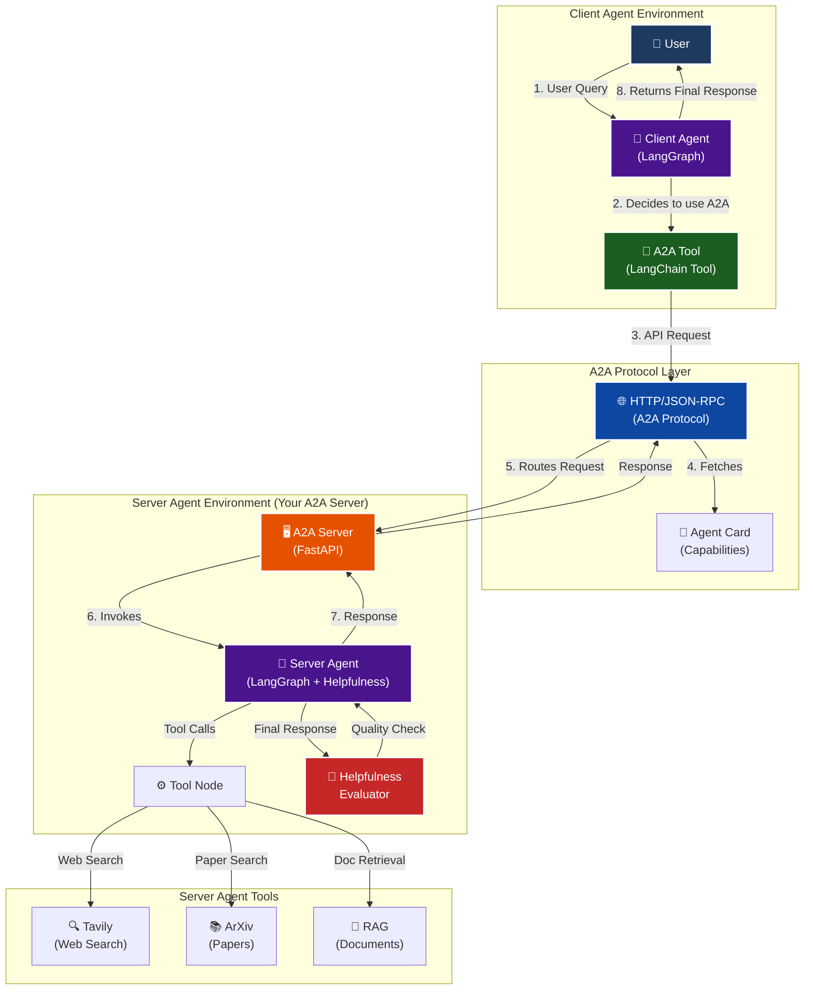

# 🏗️ Complete A2A Architecture

## System Overview

This project implements a complete **Agent-to-Agent (A2A)** communication system with two distinct agents:

1. **Server Agent** (A2A Server) - A sophisticated agent with web search, academic search, and RAG capabilities
2. **Client Agent** (LangGraph Client) - A simple orchestrator that delegates tasks to the server agent

## 🎯 Full System Architecture



## 📊 Detailed Component Breakdown

### 1. Client Agent (NEW - Activity #1)

**Location**: `app/client_agent.py`, `app/a2a_tool.py`

**Purpose**: Simple orchestrator that decides when to delegate to the A2A server

**Graph Structure**:
```
┌──────────────┐
│ Start        │
└──────┬───────┘
       │
       v
┌──────────────┐
│ Agent Node   │ ← Decides: Use A2A tool or respond directly?
└──────┬───────┘
       │
       v
┌──────────────┐     Yes      ┌──────────────┐
│ Has Tool     │─────────────>│ Action Node  │
│ Calls?       │              │ (Execute     │
└──────┬───────┘              │  A2A Tool)   │
       │                      └──────┬───────┘
       │ No                          │
       │                             │
       v                             v
┌──────────────┐              ┌──────────────┐
│ End          │<─────────────┤ Back to      │
└──────────────┘              │ Agent        │
                              └──────────────┘
```

**Key Features**:
- ReAct-style agent with tool calling
- Two A2A tools: `query_a2a_agent`, `continue_a2a_conversation`
- Memory for multi-turn conversations
- Direct response for simple queries

### 2. A2A Tool Layer (NEW)

**Location**: `app/a2a_tool.py`

**Purpose**: Wraps A2A protocol calls as LangChain tools

**Components**:
- `A2AToolManager`: Manages connections and state
- `query_a2a_agent`: Tool for new queries
- `continue_a2a_conversation`: Tool for follow-ups

**Key Features**:
- Automatic agent card fetching
- Context tracking for multi-turn
- Error handling and retries
- Async operation

### 3. A2A Server (EXISTING)

**Location**: `app/__main__.py`, `app/agent_executor.py`

**Purpose**: Serves the server agent via A2A protocol

**Components**:
- FastAPI server with A2A endpoints
- Agent card at `/.well-known/agent-card.json`
- Task management and context tracking
- Streaming response support

### 4. Server Agent (EXISTING)

**Location**: `app/agent.py`, `app/agent_graph_with_helpfulness.py`

**Purpose**: Main agent with tools and helpfulness evaluation

**Graph Structure**:
```
┌──────────────┐
│ Start        │
└──────┬───────┘
       │
       v
┌──────────────┐
│ Agent Node   │ ← LLM + Tools
└──────┬───────┘
       │
       v
┌──────────────┐     Yes      ┌──────────────┐
│ Has Tool     │─────────────>│ Action Node  │
│ Calls?       │              │ (Tavily,     │
└──────┬───────┘              │  ArXiv, RAG) │
       │                      └──────┬───────┘
       │ No                          │
       │                             │
       v                             v
┌──────────────┐              ┌──────────────┐
│ Helpfulness  │              │ Back to      │
│ Evaluator    │              │ Agent        │
└──────┬───────┘              └──────────────┘
       │
       v
┌──────────────┐     Y        ┌──────────────┐
│ Is Helpful?  │─────────────>│ End          │
└──────┬───────┘              └──────────────┘
       │ N
       │
       v
┌──────────────┐
│ Loop < 10?   │ Yes ──> Back to Agent
└──────┬───────┘
       │ No
       v
     End
```

## 🔄 Complete Request Flow

### Scenario: User asks "Find papers on transformers"

```
1. User Input
   👤 User: "Find papers on transformers"
   
2. Client Agent Receives
   🤖 Client Agent: Processes query
   - Recognizes need for academic search
   - Decides to use query_a2a_agent tool
   
3. A2A Tool Call
   🔧 A2A Tool:
   - Fetches agent card (if not cached)
   - Constructs A2A request
   - Sends HTTP POST to http://localhost:10000
   
4. A2A Protocol Layer
   🌐 HTTP/JSON-RPC:
   {
     "method": "tasks/send-message",
     "params": {
       "message": {
         "role": "user",
         "parts": [{"kind": "text", "text": "Find papers on transformers"}]
       }
     }
   }
   
5. A2A Server Receives
   🖥️ A2A Server: Routes to agent executor
   
6. Server Agent Processes
   🤖 Server Agent:
   a. Agent Node: Decides to use ArXiv tool
   b. Action Node: Calls ArxivQueryRun
   c. Tool executes: Searches ArXiv database
   d. Back to Agent: Formats results
   e. Helpfulness Node: Evaluates quality
   f. Decision: Response is helpful (Y)
   
7. A2A Server Responds
   🖥️ A2A Server: Returns result via A2A protocol
   {
     "result": {
       "id": "task-123",
       "context_id": "ctx-456",
       "artifacts": [{
         "parts": [{"kind": "text", "text": "Found 5 papers..."}]
       }]
     }
   }
   
8. A2A Tool Returns
   🔧 A2A Tool: Extracts text, returns to client agent
   
9. Client Agent Formats
   🤖 Client Agent: Receives tool result, generates final response
   
10. User Receives
    👤 User sees: "Found 5 papers on transformers:
    1. 'Attention Is All You Need 2.0' - [arXiv:2024.xxxxx]
    ..."
```

## 📡 A2A Protocol Details

### Agent Card Structure

The agent card advertises capabilities:

```json
{
  "name": "General Purpose Agent",
  "description": "A helpful AI assistant with web search, academic paper search, and document retrieval capabilities",
  "version": "1.0.0",
  "url": "http://localhost:10000/",
  "protocolVersion": "0.3.0",
  "preferredTransport": "JSONRPC",
  "capabilities": {
    "streaming": true,
    "pushNotifications": true
  },
  "skills": [
    {
      "id": "web_search",
      "name": "Web Search Tool",
      "description": "Search the web for current information",
      "tags": ["search", "web", "internet"],
      "examples": ["What are the latest news about AI?"]
    },
    {
      "id": "arxiv_search",
      "name": "Academic Paper Search",
      "description": "Search for academic papers on arXiv",
      "tags": ["research", "papers", "academic"],
      "examples": ["Find recent papers on large language models"]
    },
    {
      "id": "rag_search",
      "name": "Document Retrieval",
      "description": "Search through loaded documents for specific information",
      "tags": ["documents", "rag", "retrieval"],
      "examples": ["What do the policy documents say about student loans?"]
    }
  ],
  "defaultInputModes": ["text", "text/plain"],
  "defaultOutputModes": ["text", "text/plain"]
}
```

### Message Exchange Format

**Request**:
```json
{
  "jsonrpc": "2.0",
  "id": "req-uuid",
  "method": "tasks/send-message",
  "params": {
    "message": {
      "role": "user",
      "message_id": "msg-uuid",
      "parts": [
        {
          "kind": "text",
          "text": "Your query here"
        }
      ]
    }
  }
}
```

**Response**:
```json
{
  "jsonrpc": "2.0",
  "id": "req-uuid",
  "result": {
    "id": "task-uuid",
    "context_id": "ctx-uuid",
    "state": "completed",
    "artifacts": [
      {
        "name": "result",
        "parts": [
          {
            "kind": "text",
            "text": "Response content here"
          }
        ]
      }
    ]
  }
}
```

## 🔌 Multi-Turn Conversation

### First Turn

```
Client → Server: "Find papers on transformers"
Server → Client: [Returns paper list with context_id=ctx-123, task_id=task-456]
```

### Second Turn (Follow-up)

```
Client → Server: "Summarize the first one" 
              + context_id=ctx-123 
              + task_id=task-456
Server → Client: [Knows conversation history, summarizes first paper]
```

The A2A tool manager automatically tracks `context_id` and `task_id` for seamless multi-turn.

## 🛠️ Technology Stack

### Client Agent
- **LangGraph**: Graph orchestration
- **LangChain**: Tool abstraction
- **OpenAI**: LLM for decision making
- **httpx**: Async HTTP client
- **a2a-python**: A2A protocol library

### Server Agent
- **LangGraph**: Agent graph with helpfulness loop
- **FastAPI**: HTTP server
- **OpenAI**: LLM for agent reasoning
- **Tavily**: Web search
- **ArXiv**: Academic paper search
- **Qdrant**: Vector database for RAG

### Shared Infrastructure
- **A2A Protocol**: Agent communication standard
- **JSON-RPC**: Transport protocol
- **Pydantic**: Data validation

## 📏 Performance Characteristics

### Latencies (Typical)

| Operation | Time | Notes |
|-----------|------|-------|
| Client Agent (direct) | 1-3s | Simple responses |
| A2A Tool Call (simple) | 5-15s | Query + one tool |
| A2A Tool Call (complex) | 15-30s | Multiple tools + helpfulness |
| Multi-turn Follow-up | 3-10s | Context already established |
| Agent Card Fetch | 100-500ms | Cached after first call |

### Resource Usage

| Component | Memory | CPU |
|-----------|--------|-----|
| Client Agent | ~500MB | Low (waiting for I/O) |
| Server Agent | ~1-2GB | Medium (LLM + embeddings) |
| Tools (Tavily/ArXiv) | ~100MB | Low (API calls) |
| RAG (Qdrant) | ~500MB-2GB | Medium (depends on docs) |

## 🔐 Security & Best Practices

### Authentication

Currently implemented: **None** (local development)

For production:
```python
# Add authentication headers in a2a_tool.py
auth_headers = {'Authorization': f'Bearer {api_token}'}
httpx_client = httpx.AsyncClient(headers=auth_headers)
```

### Rate Limiting

The A2A server should implement rate limiting:
```python
from slowapi import Limiter

limiter = Limiter(key_func=get_remote_address)
app.state.limiter = limiter

@app.post("/tasks/send-message")
@limiter.limit("10/minute")
async def send_message(...):
    ...
```

### Input Validation

Both agents validate inputs:
- Client agent: Checks query format
- Server agent: Validates message structure
- Tools: Validate parameters before execution

## 🎓 Key Design Decisions

### 1. Why Two Separate Agents?

**Separation of Concerns**:
- **Client Agent**: Simple orchestrator, delegation logic
- **Server Agent**: Complex capabilities, specialized tools

**Benefits**:
- Client can swap out server implementations
- Server can serve multiple clients
- Independent scaling and deployment

### 2. Why A2A Protocol?

**Standardization**:
- Standard format for agent communication
- Agent discovery via agent cards
- Multi-turn conversation support
- Streaming and push notifications

### 3. Why LangGraph for Both?

**Consistency**:
- Same framework for both agents
- Graph-based reasoning for both
- Easy to understand and extend
- Built-in memory and checkpointing

## 🚀 Deployment Options

### Option 1: Local Development (Current)

```bash
# Terminal 1: Server
uv run python -m app

# Terminal 2: Client
uv run python app/run_client_agent.py -i
```

### Option 2: Docker Containers

```dockerfile
# Server Dockerfile
FROM python:3.12
COPY app/ /app/
RUN pip install -e .
CMD ["python", "-m", "app"]

# Client Dockerfile
FROM python:3.12
COPY app/ /app/
RUN pip install -e .
CMD ["python", "app/run_client_agent.py", "-i"]
```

### Option 3: Cloud Deployment

**Server**: Deploy as a web service (Railway, Render, AWS)
**Client**: Run locally or as a separate service

```python
# Update base_url in client_agent.py
agent = create_client_agent("https://your-server.com")
```

## 🔮 Future Enhancements

### 1. Multi-Agent Orchestration

Add multiple specialized servers:
```python
research_agent = "http://research-server:10000"
coding_agent = "http://coding-server:10001"
design_agent = "http://design-server:10002"

# Route based on query type
def route_query(query):
    if "code" in query: return coding_agent
    if "research" in query: return research_agent
    if "design" in query: return design_agent
```

### 2. Enhanced Helpfulness Evaluation

Multi-dimensional evaluation:
- Factual accuracy score
- Completeness score
- Source quality score
- User satisfaction prediction

### 3. Caching & Performance

```python
# Cache A2A responses
from functools import lru_cache

@lru_cache(maxsize=1000)
def cached_query(query_hash):
    return query_a2a_agent(query)
```

### 4. Observability

Add tracing and monitoring:
```python
from langsmith import trace

@trace
async def send_message(message):
    # Automatic tracing in LangSmith
    ...
```

## 📚 Additional Resources

- **A2A Protocol Spec**: https://github.com/a2a-protocol/a2a
- **LangGraph Docs**: https://langchain-ai.github.io/langgraph/
- **Client Agent Guide**: [CLIENT_AGENT.md](./CLIENT_AGENT.md)
- **Server Implementation**: [app/README.md](./app/README.md)

---

**This architecture demonstrates a complete A2A implementation with proper separation of concerns, standard protocols, and extensible design.**

