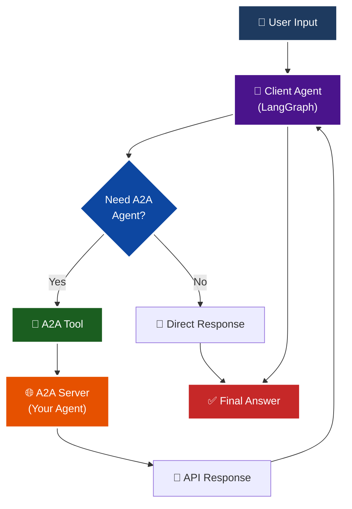

# 🔄 A2A Client Agent - LangGraph Implementation

## Overview

This client agent is a **LangGraph-based AI agent** that communicates with your A2A-compliant agent server. It demonstrates how to build an agent that can delegate tasks to another agent using the A2A (Agent-to-Agent) protocol.

## 🎯 What is This?

The client agent is a **simple orchestrator** that:
1. Takes user queries
2. Decides when to delegate tasks to the A2A server agent
3. Manages conversation context across multiple turns
4. Returns results to the user

Think of it as a "meta-agent" that knows when to call upon a specialized agent for help.

## 📊 Architecture



## 📁 Files Created

```
app/
├── a2a_tool.py              # LangChain tool for A2A API calls
├── client_agent.py          # LangGraph client agent implementation
├── run_client_agent.py      # Interactive CLI runner
└── visualize_client.py      # Graph visualization script
```

## 🔧 Component Details

### 1. **a2a_tool.py** - A2A Communication Tool

This module provides LangChain tools that wrap the A2A protocol:

**Tools:**
- `query_a2a_agent(query: str)` - Send a new query to the A2A agent
- `continue_a2a_conversation(follow_up: str)` - Continue an existing conversation

**Key Features:**
- Automatic A2A client initialization
- Agent card fetching and caching
- Context management for multi-turn conversations
- Error handling and logging

**Example Usage:**
```python
from app.a2a_tool import query_a2a_agent

# Call the A2A agent
response = await query_a2a_agent("What are the latest AI developments?")
```

### 2. **client_agent.py** - LangGraph Client Agent

The main client agent graph with tool delegation logic.

**Graph Structure:**
```python
StateGraph:
  - agent node: Decides whether to use A2A tools or respond directly
  - action node: Executes A2A tool calls
  - Conditional routing: tool calls → action, no tools → END
```

**Key Features:**
- Simple ReAct-style agent with tool calling
- Memory persistence for conversation history
- System instructions for delegation strategy
- Automatic tool selection

### 3. **run_client_agent.py** - Interactive CLI

User-friendly CLI for testing the client agent.

**Modes:**
- **Interactive Mode**: Continuous conversation session
- **Single Query Mode**: One-off query execution

**Usage:**
```bash
# Interactive mode (default)
uv run python app/run_client_agent.py -i

# Single query
uv run python app/run_client_agent.py -q "Find papers on transformers"

# Custom server URL
uv run python app/run_client_agent.py --base-url http://localhost:8080 -i
```

### 4. **visualize_client.py** - Graph Visualization

Generates visual representations of the client agent graph.

**Usage:**
```bash
uv run python app/visualize_client.py
```

**Outputs:**
- `client_agent_graph.mmd` - Mermaid diagram
- `client_agent_graph.png` - PNG image (if graphviz available)

## 🚀 Getting Started

### Prerequisites

1. **Start the A2A Server** (in one terminal):
```bash
uv run python -m app
```

The server should be running at `http://localhost:10000`

2. **Verify Server is Running**:
```bash
# Should return agent card
curl http://localhost:10000/.well-known/agent.json
```

### Running the Client Agent

**Option 1: Interactive Mode (Recommended)**
```bash
uv run python app/run_client_agent.py -i
```

**Option 2: Single Query**
```bash
uv run python app/run_client_agent.py -q "What are recent AI developments?"
```

**Option 3: Python Script**
```python
from app.client_agent import create_client_agent
from uuid import uuid4

# Create the agent
agent = create_client_agent("http://localhost:10000")

# Run a query
thread_id = uuid4().hex
config = {"configurable": {"thread_id": thread_id}}
inputs = {"messages": [("user", "Find papers on transformers")]}

# Stream results
async for event in agent.astream(inputs, config):
    print(event)
```

## 💬 Example Conversations

### Example 1: Web Search Delegation

```
👤 You: What are the latest developments in artificial intelligence in 2025?

🤖 Agent (thinking...)
   🔧 Using tool: query_a2a_agent

🤖 Agent: Based on the search results, here are the latest AI developments in 2025:

1. **Advanced Multimodal Models**: Several companies have released models that 
   seamlessly integrate text, images, audio, and video...
   
2. **AI Regulation**: New regulations have been implemented in the EU...

[Full response from A2A agent]
```

### Example 2: Academic Search

```
👤 You: Find recent papers on transformer architectures

🤖 Agent (thinking...)
   🔧 Using tool: query_a2a_agent

🤖 Agent: I found several recent papers on transformer architectures:

1. "Attention Is All You Need 2.0" - [arXiv:2024.xxxxx]
   This paper extends the original transformer...

[Papers from ArXiv search]
```

### Example 3: Follow-up Conversation

```
👤 You: Find papers on large language models

🤖 Agent: [Returns papers from A2A agent]

👤 You: Can you summarize the key findings?

🤖 Agent (thinking...)
   🔧 Using tool: continue_a2a_conversation

🤖 Agent: Based on the papers, the key findings are:
1. Scaling laws continue to hold...
2. Architecture improvements focus on...

[Summarized findings]
```

### Example 4: Direct Response (No A2A Call)

```
👤 You: What is 2 + 2?

🤖 Agent: 2 + 2 equals 4. This is a simple arithmetic question I can 
answer directly without needing to use external tools.
```

## 🎓 How It Works

### 1. **Tool Decision Making**

The client agent uses a **decision-making process** to determine when to use the A2A tool:

```python
# From the system instruction:
system_instruction = """
When a user asks a question:
1. If the question requires real-time information, academic research, 
   or document retrieval, use the query_a2a_agent tool
2. If the user asks a follow-up, use continue_a2a_conversation
3. For simple questions, respond directly without tools
"""
```

### 2. **Context Management**

The A2A tool manager maintains conversation context:

```python
class A2AToolManager:
    def __init__(self):
        self.context_id = None  # Tracks conversation
        self.task_id = None     # Tracks current task
    
    async def send_message(self, message, continue_conversation=False):
        if continue_conversation and self.context_id:
            # Reuse existing context
            message['context_id'] = self.context_id
            message['task_id'] = self.task_id
```

### 3. **Graph Execution Flow**

```python
User Query → Agent Node → Conditional Router
                ↓              ↓
         No Tool Calls    Tool Calls Needed
                ↓              ↓
              END         Action Node (A2A Tool)
                              ↓
                         Back to Agent
                              ↓
                            END
```

## 🧪 Testing Scenarios

### Test 1: Basic A2A Delegation
```bash
python app/run_client_agent.py -q "What happened in AI research today?"
# Expected: Should use A2A agent with web search
```

### Test 2: Academic Search
```bash
python app/run_client_agent.py -q "Find papers on attention mechanisms"
# Expected: Should use A2A agent with ArXiv search
```

### Test 3: Direct Response
```bash
python app/run_client_agent.py -q "Hello, how are you?"
# Expected: Should respond directly without A2A call
```

### Test 4: Multi-Turn Conversation
Start interactive mode and try:
```
You: Find papers on GPT-4
Agent: [Returns papers]

You: Summarize the first one
Agent: [Should use continue_a2a_conversation]
```

## 🔍 Debugging

### Enable Debug Logging

```python
import logging
logging.basicConfig(level=logging.DEBUG)
```

### Check A2A Server Connection

```bash
# Test server is running
curl http://localhost:10000/.well-known/agent.json

# Should return agent card JSON
```

### Verify Tools Are Available

```python
from app.a2a_tool import query_a2a_agent, continue_a2a_conversation

print(query_a2a_agent.name)  # Should print: query_a2a_agent
print(query_a2a_agent.description)  # Should show tool description
```

### Common Issues

| Issue | Cause | Solution |
|-------|-------|----------|
| **"Connection refused"** | A2A server not running | Start server: `uv run python -m app` |
| **"Timeout error"** | Server taking too long | Increase timeout in `a2a_tool.py` |
| **"No tool calls"** | Agent not recognizing need | Improve system instruction or query |
| **"Context lost"** | Multi-turn not working | Check context_id/task_id management |

## 🎨 Customization

### Change Server URL

```python
# In run_client_agent.py
agent = create_client_agent("http://your-server:8080")
```

### Modify System Instructions

Edit `client_agent.py`:
```python
system_instruction = """
Your custom instructions here...
- When to use A2A agent
- How to handle responses
- Delegation strategy
"""
```

### Add More Tools

```python
# In client_agent.py
from langchain_core.tools import tool

@tool
def my_custom_tool(query: str) -> str:
    """Your custom tool description"""
    return "result"

# Add to tools list
tools = [query_a2a_agent, continue_a2a_conversation, my_custom_tool]
```

### Adjust Model Parameters

```python
# In client_agent.py
model = ChatOpenAI(
    model='gpt-4o',  # Use a different model
    temperature=0.9,  # More creative
)
```

## 📈 Performance Considerations

### Response Times

Typical latencies:
- **Direct Response**: 1-3 seconds
- **A2A Tool Call**: 5-30 seconds (depends on A2A agent's work)
- **Multi-turn**: 3-20 seconds (context already established)

### Optimization Tips

1. **Caching**: The A2A tool manager caches the agent card
2. **Async Operations**: All tool calls are async for better performance
3. **Timeouts**: Configured to 60s to handle long LLM responses
4. **Connection Reuse**: HTTP client is reused across requests

## 🔐 Security Considerations

### API Authentication

To add authentication to A2A calls:

```python
# In a2a_tool.py
async def initialize(self):
    auth_headers = {'Authorization': 'Bearer your-token'}
    self.httpx_client = httpx.AsyncClient(
        timeout=httpx.Timeout(60.0),
        headers=auth_headers
    )
```

### Input Validation

The A2A tools validate inputs before sending:
```python
if not query or not isinstance(query, str):
    return "Error: Invalid query format"
```

## 🚀 Advanced Usage

### Streaming Responses

```python
async def stream_with_intermediate_steps(agent, query):
    """Stream agent responses with intermediate steps."""
    
    config = {"configurable": {"thread_id": uuid4().hex}}
    inputs = {"messages": [("user", query)]}
    
    async for event in agent.astream(inputs, config, stream_mode="values"):
        if "messages" in event:
            last_msg = event["messages"][-1]
            
            # Check message type
            if last_msg.type == "ai":
                print(f"AI: {last_msg.content}")
            elif last_msg.type == "tool":
                print(f"Tool Call: {last_msg.name}")
```

### Custom Response Formatting

```python
def format_response(response):
    """Format A2A response with rich formatting."""
    
    # Extract sections
    if "sources:" in response.lower():
        parts = response.split("sources:", 1)
        main_content = parts[0]
        sources = parts[1]
        
        return f"""
### Answer
{main_content}

### Sources
{sources}
"""
    
    return response
```

### Integration with Other Agents

```python
# Create multiple A2A clients
research_agent = create_client_agent("http://localhost:10000")
coding_agent = create_client_agent("http://localhost:10001")

# Route based on query type
def route_query(query):
    if "code" in query.lower():
        return coding_agent
    else:
        return research_agent
```

## 📚 Additional Resources

### LangGraph Documentation
- [LangGraph Docs](https://langchain-ai.github.io/langgraph/)
- [Tool Calling Guide](https://python.langchain.com/docs/modules/agents/tools/)

### A2A Protocol
- [A2A Specification](https://github.com/a2a-protocol/a2a)
- [A2A Python Client](https://github.com/a2a-protocol/a2a-python)

### Related Files
- Main Agent: `app/agent.py`
- A2A Server: `app/__main__.py`
- Agent Executor: `app/agent_executor.py`

## 🎯 Key Takeaways

1. **Delegation Pattern**: The client agent demonstrates how one agent can delegate to another
2. **A2A Protocol**: Standard protocol enables agent-to-agent communication
3. **Tool Abstraction**: A2A calls are wrapped as LangChain tools
4. **Context Management**: Multi-turn conversations work seamlessly
5. **Modular Design**: Easy to extend with additional tools or agents

---

**Built with ❤️ using LangGraph and the A2A Protocol**

